# Evoker Reloaded - Persona 3 Reload NXTheme

Fellow Persona enthusiasts, maybe this will please you.

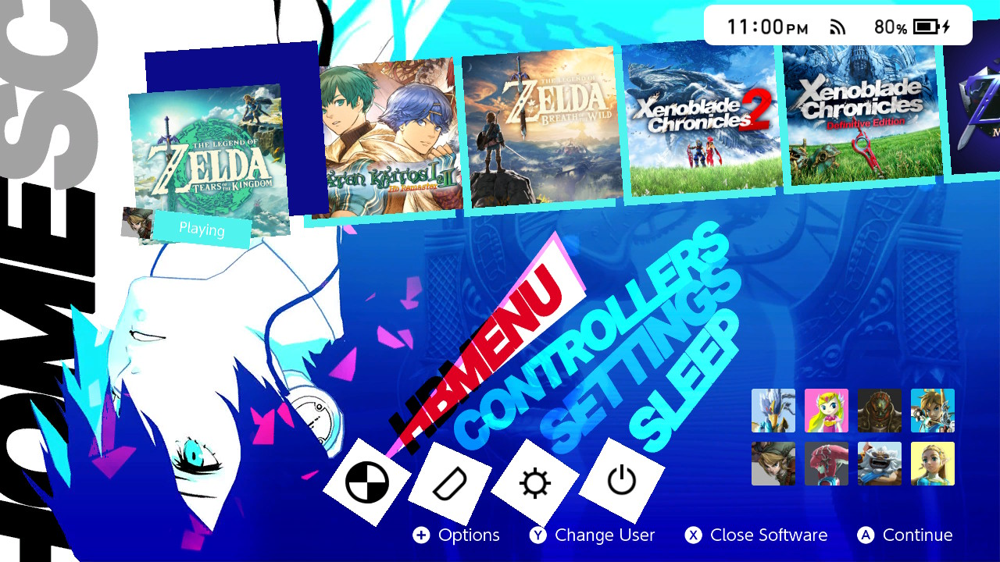
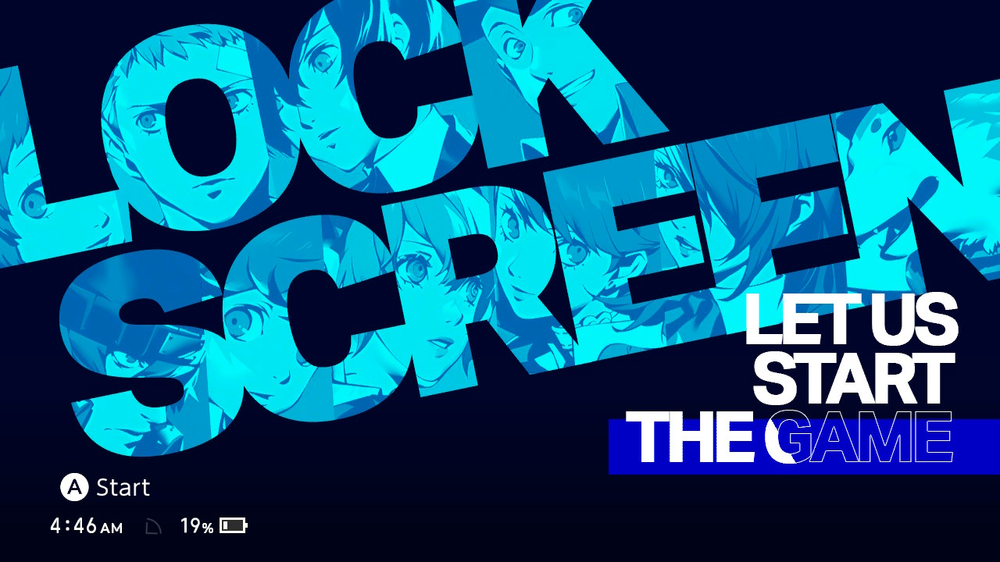

## [Download on Themezer](https://themezer.net/packs/Evoker-Reloaded-Persona-3-Reload-746)

Yet another NXTheme project, this time around inspired by Persona 3 Reload. I tried my best to capture the stylish feel of P3R's gorgeous UI with custom assets and fancy animations. This is probably my most ambitious release yet as it involved both Switch theming techniques and more demanding Photoshop skills than usual.

This project was made on a whim, sort of as a commemoration of P3R's release - I don't intend to maintain it seriously, nor do I have the time, so I won't guarantee issue reports will be taken care of immediately, if ever.

**Make sure to enable dark mode in System Settings.**

## Showcase

### Home Screen (2nd layout)

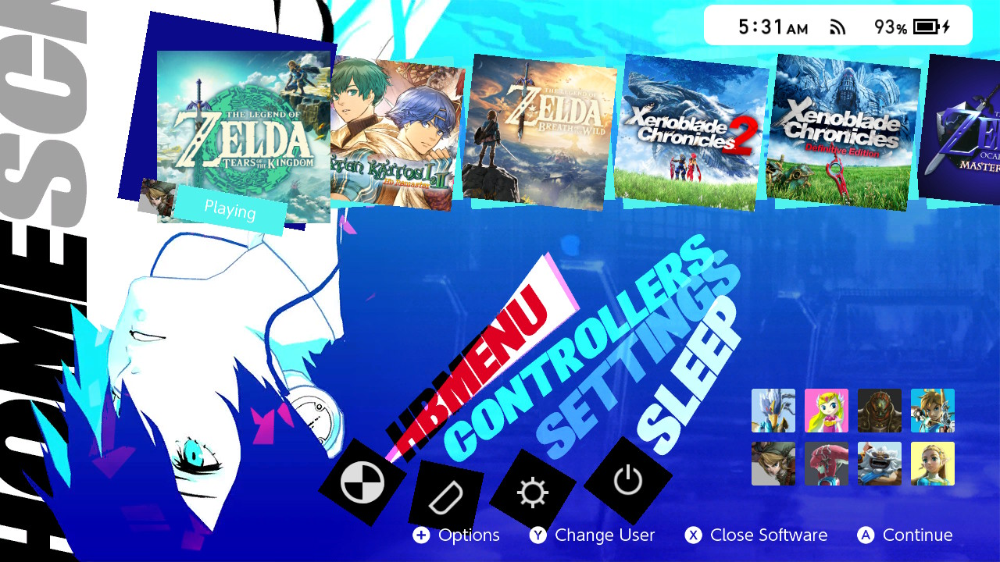
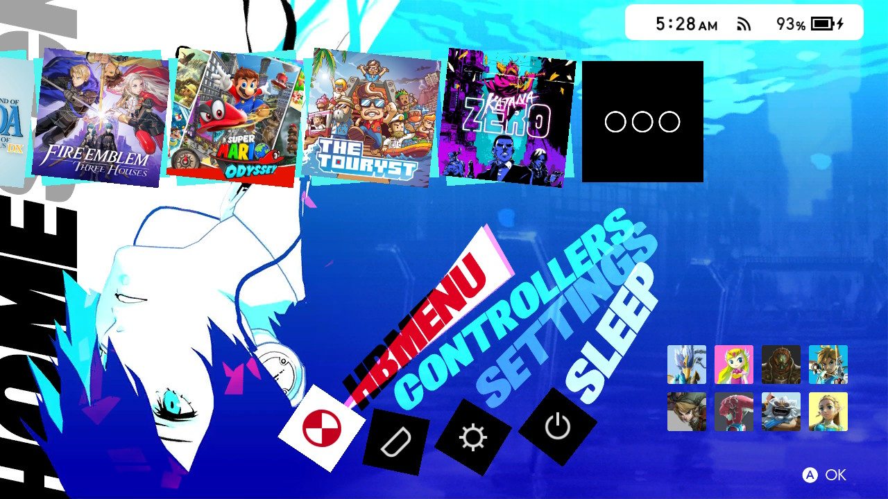
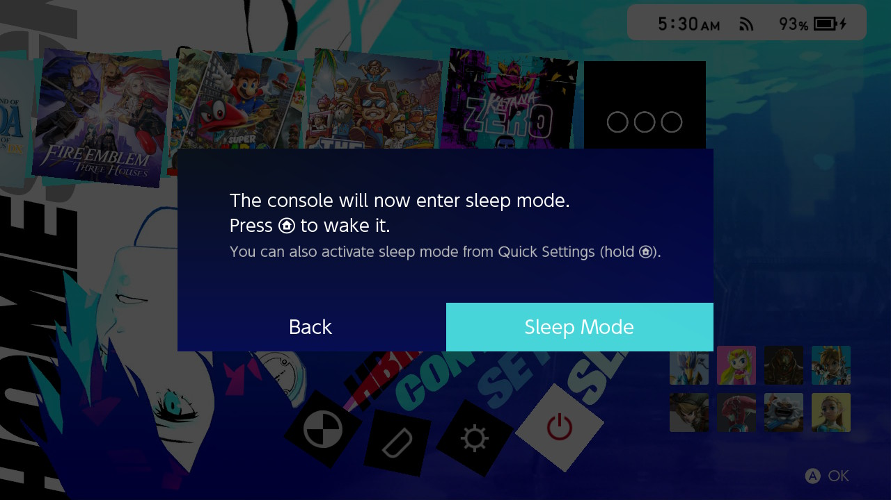

### Settings

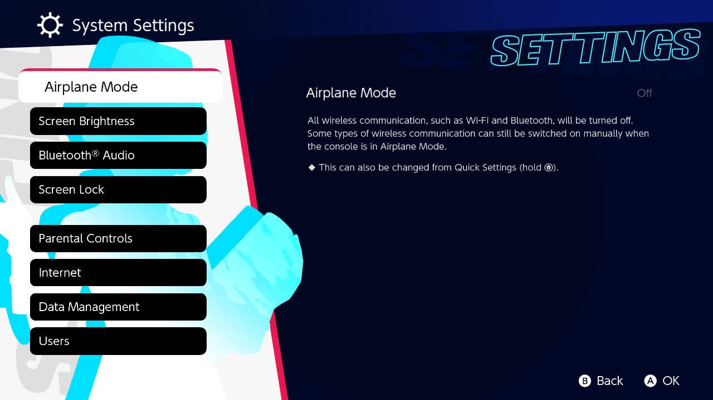

### User Page

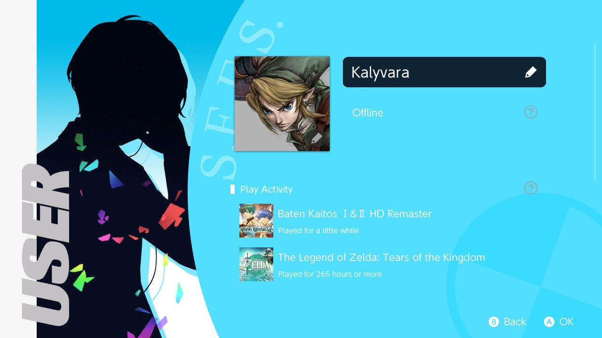

### Lock Screen

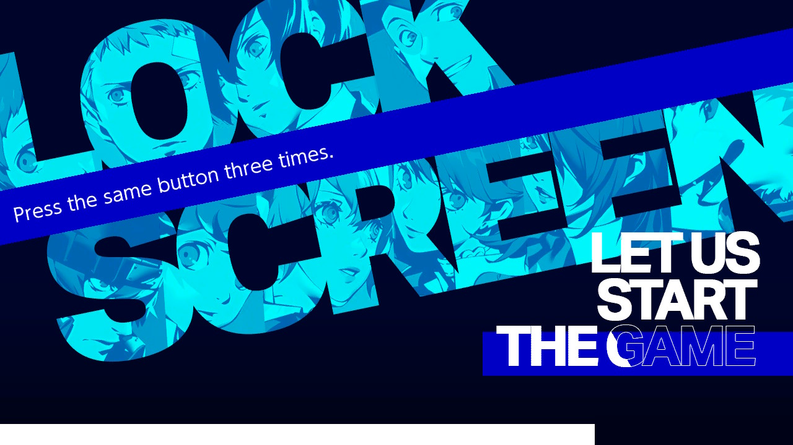
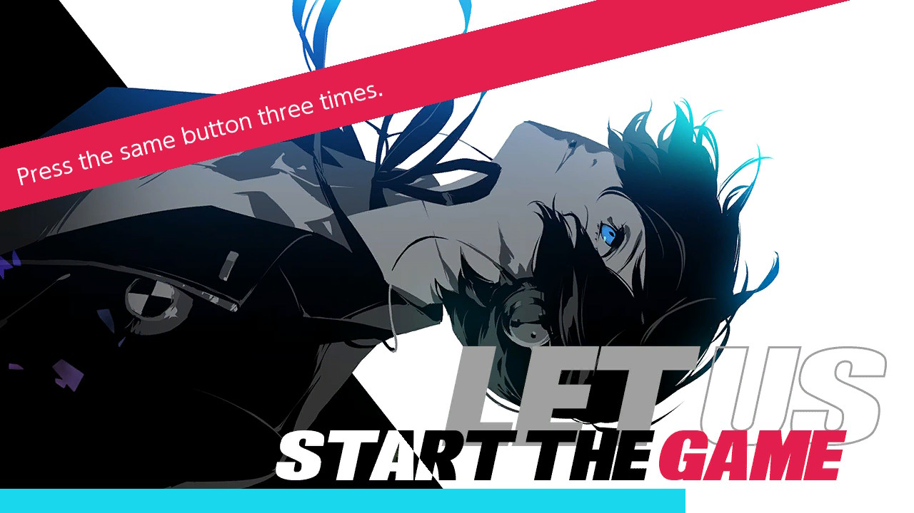

### All Software

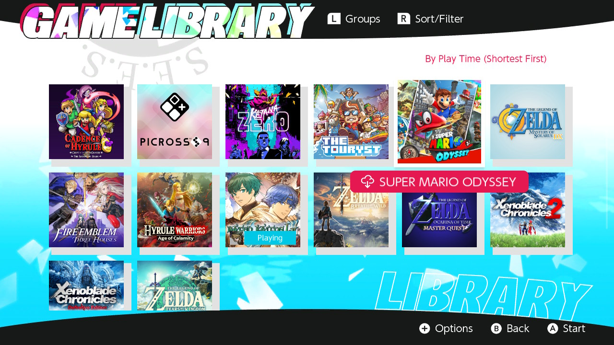

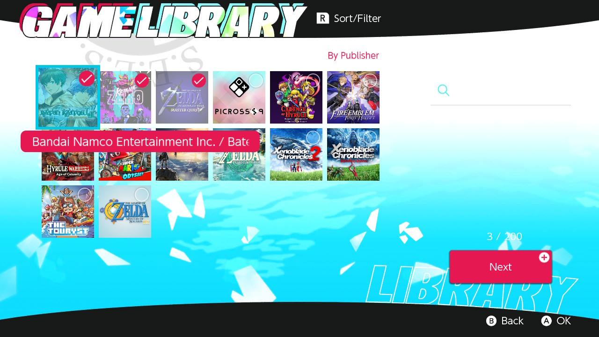
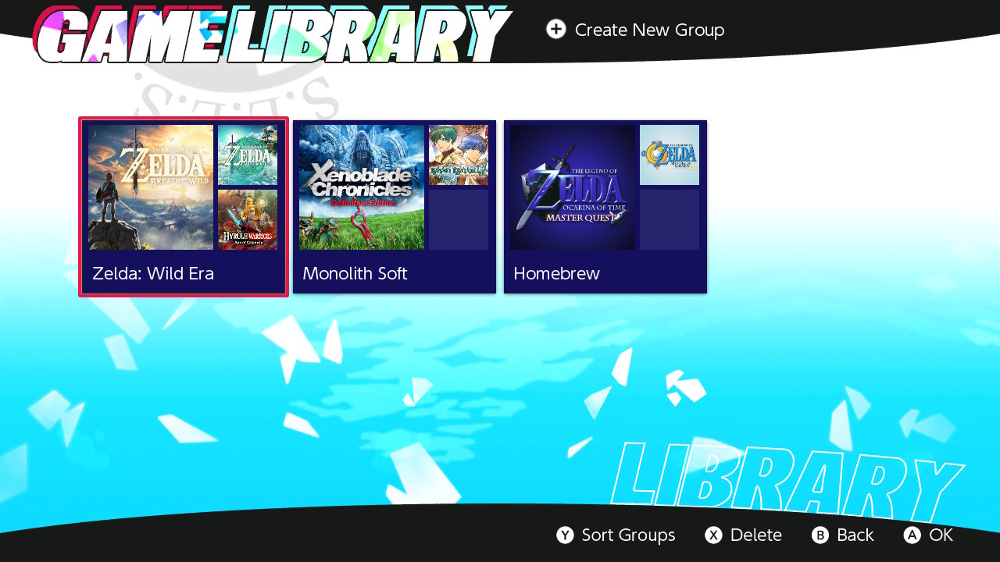

### Player Selection

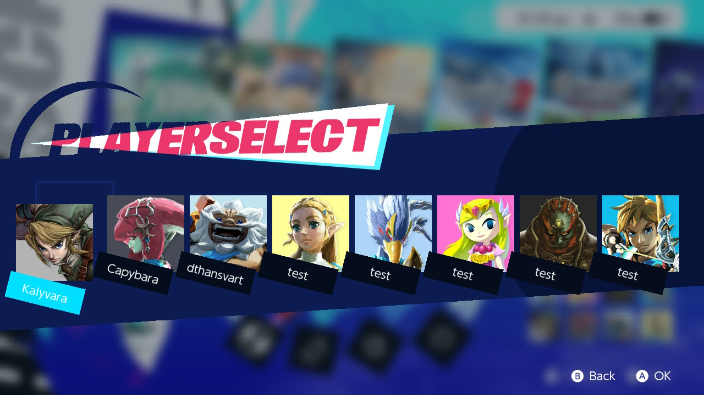

## Credits

- **Artworks used are the property of Atlus**
- **Custom assets:** applet background images, Gekkoukan icon
- **Fonts:**
  - **UI:** AktivGrotesk (new font), News of the World (old font)
  - **S.E.E.S. logo:** Dutch811BT, Libre Caslon Text
